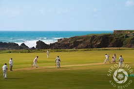
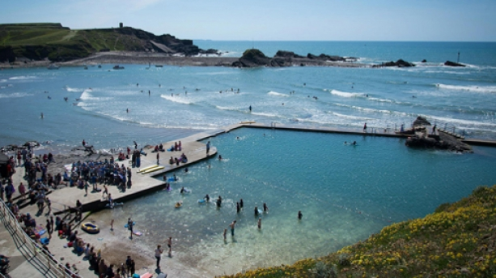
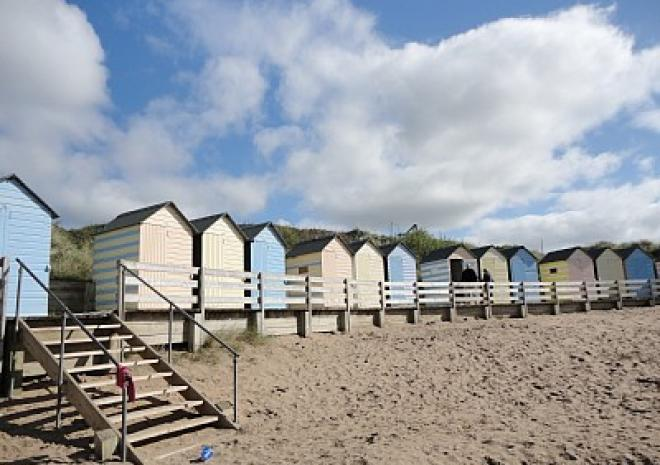

```{r setup, include=FALSE}
knitr::opts_chunk$set(echo = TRUE)
```

```{r}
library(ggmap)
library(tidyverse)
library(devtools)
```

## Road map

```{r}
map <- get_googlemap(center = c(-4.5437, 50.8266), zoom = 15)
ggmap(map)
```

## Watercolor Map

```{r}
watercolor <- get_map("Bude", maptype = "watercolor", zoom = 15)
ggmap(watercolor)
```

## Marked road map
### Crooklets beach, Cricket grounds, Bude sea pool, Summerleaze beach

```{r}
ggmap(map) +
  geom_point(
    aes(x = -4.553962 , y = 50.835),
    color = "yellow", size = 3) +
  geom_point(
    aes(x = -4.553165 , y = 50.832584),
    color = "green", size = 3) +
  geom_point(
    aes(x = -4.553974 , y = 50.832574),
    color = "blue", size = 3)+
  geom_point(
    aes(x = -4.551349, y = 50.830540),
    color = "red", size = 3)
```

## Watercolor marked map
### crooklets beach, cricket grounds, bude sea pool, summerleaze beach

```{r}
ggmap(watercolor) +
  geom_point(
    aes(x = -4.553962 , y = 50.835),
    color = "yellow", size = 3) +
  geom_point(
    aes(x = -4.553165 , y = 50.832584),
    color = "green", size = 3) +
  geom_point(
    aes(x = -4.553974 , y = 50.832574),
    color = "blue", size = 3)+
  geom_point(
    aes(x = -4.551349, y = 50.830540),
    color = "red", size = 3)
```

## Route
```{r}
from <- "Bude North Cornwall Cricket Club"
to <- "The Barrell at Bude"
route_df <- route(from, to, structure = "route")
ggmap(map) +
  geom_point(
    aes(x = -4.553165 , y = 50.832584),
    color = "blue", size = 3)+
  geom_point(
    aes(x = -4.543023, y = 50.830066),
    color = "green", size = 3) +
  geom_path(
    aes(x = lon, y = lat), colour = "yellow", size = 1.5,
    data = route_df, lineend = "round"
  )
```

## Route on watercolor map
```{r}
from <- "Bude North Cornwall Cricket Club"
to <- "The Barrell at Bude"
route_df <- route(from, to, structure = "route")
ggmap(watercolor) +
  geom_point(
    aes(x = -4.553165 , y = 50.832584),
    color = "blue", size = 3)+
  geom_point(
    aes(x = -4.543023, y = 50.830066),
    color = "green", size = 3) +
  geom_path(
    aes(x = lon, y = lat), colour = "yellow", size = 1.5,
    data = route_df, lineend = "round"
  )
```

## Crooklets Beach


Crooklets beach is great for experienced surfers. Be aware of submerged rocks at high tide though. This beach has a large parking lot, a playground, skate park, a beach cafe and showers and has lifeguards on duty. 

https://www.visitcornwall.com/beaches/lifeguards-seasonal/north-coast/bude/crooklets-beach

## Bude North Cornwall Cricket Club



Bude North Cornwall Cricket Club is on the cliff overlooking the ocean. It was founded in 1870 and has hosted cricket matches as well as hockey and tennis matches. Now, it hosts cricket teams from around the world. 

http://budecc.play-cricket.com

## Bude Sea Pool



Bude Sea Pool is on the South West Coast Path, above Summerleaze Beach. It provides a safer environment for swimmers, as it is enclosed. However, it is a natural environment so there are still sharp rocks and the bottom is slippery. 

- http://www.budeseapool.org/frequently-asked-questions/
  
## Summerleaze Beach
  


Summerleaze Beach is located only 5 minutes from the center of Bude. Is has a large breakwater with a tower that protects the harbour and the mouth of the Bude canal with a lock gate. 

- https://www.cornwall-beaches.co.uk/north-cornwall/summerleaze.htm

## Barrel at Bude


The Barrel at Bude is the second largest micropub to open in Cornwall. Its in one of the oldest cottages and in the center of Bude. The bar insisde is made from local beach hut timbers that were destroyed in a winter storm. 

- http://www.micropubassociation.co.uk/micropubs/the-barrel-at-bude/

#Images


